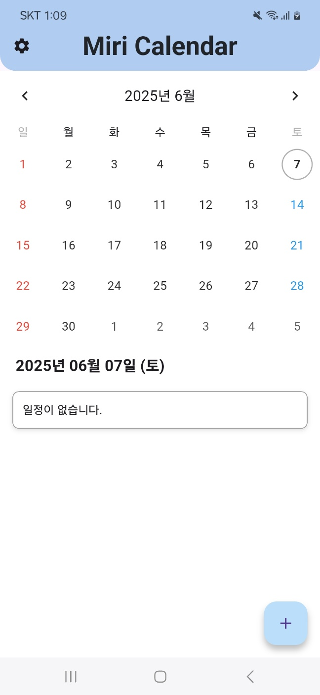
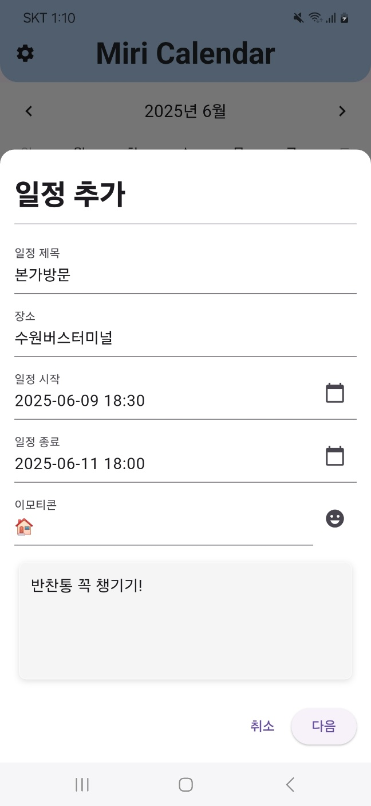
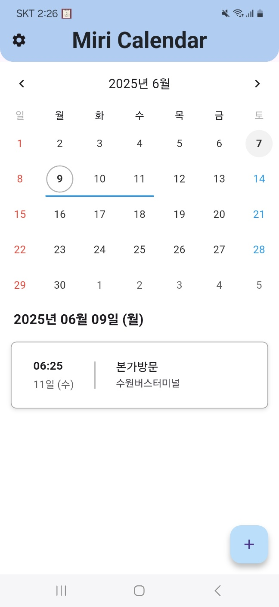
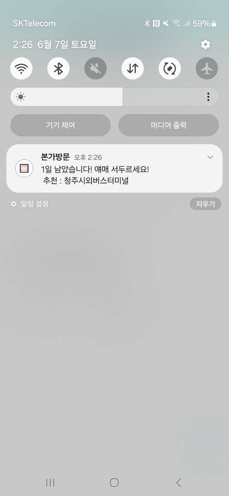

# MIRI Calendar
---
충북대학교 오픈소스기초프로젝트 '민혁의 카피바라들' 팀에서 진행한 프로젝트
기존의 캘린더 앱에서 지역에서 지역을 이동하는 일정이 있는 경우 버스나 기차 예매를 까먹지 않게 푸쉬알림을 주는 앱을 개발

## 🚀프로젝트 개요
바쁜 일상을 살아가다 보면 본가를 가는 등의 지역 이동을 위한 버스나 기차 예매를 까먹고 놓칠 때가 있다.
미리 알림을 설정하거나, 다른 일정으로 버스 예매를 설정하는 등의 대안이 있지만, 미리 알림을 해줌으로써 사람들의 불편함을 해소할 수 있다고 생각헀다.
### 이 앱에서는
- 일정을 등록할 때 장소를 상세히 기록할 수 있다.
- 일정에 등록한 장소가 버스나 기차 예매가 필요한 거리이면, 일정을 등록하는 과정에서 미리 예매를 하거나 미리 알림으로 예매사이트로 연결해준다.
- To Do List 기능과 그 날에 날씨를 파악한 준비물 추천도 해준다.

## ⏳개발 기간
2025.03.30(일) ~ 2025.06.06(금)

## 👩‍💻개발자 소개
- 김윤태 @rladbsxo2022040033 (E-mail: jungryeok168@naver.com)
- 김주완 @kimjuwan03 (E-mail: juwankim03@gmail.com)
- 박민석 @skinheadman (E-mail: zzzoad929@gmail.com)
- 인민혁 @dlsalsgur03 (E-mail: dlsalsgur2@gmail.com)

## ⚙️설치 방법

## 🖥️실행 화면

앱을 실행하면 다음과 같은 화면이 표시됩니다.
화면 오른쪽 아래에 있는 + 버튼을 눌러 일정을 추가할 수 있습니다.

팝업창이 생성되면 원하는 일정의 정보를 입력할 수 있습니다.

위 이미지는 일정이 입력된 예시 이미지 입니다.

일정까지 남은 시간이 3일 이내라면 대중교통 예매를 권고하는 알림이 전송됩니다.
## 📦의존성
```yaml
dependencies:
    flutter:
        sdk: flutter
    emoji_picker_flutter: ^1.6.1
    flutter_colorpicker: ^1.0.3
    flutter_localizations:
        sdk: flutter
    url_launcher: ^6.0.0
    cupertino_icons: ^1.0.8
    csv: ^6.0.0
    http: ^1.4.0
    intl: ^0.19.0
    table_calendar: ^3.1.3
    timezone: ^0.9.1
    path_provider: ^2.1.5
    flutter_dotenv: ^5.2.1
    shared_preferences: ^2.2.3
    permission_handler: ^11.1.0
    flutter_local_notifications: ^16.3.0
    flutter_native_splash: ^2.4.6
    animated_splash_screen: ^1.3.0
    flutter_map: ^6.1.0
    latlong2: ^0.9.0
    geolocator: ^11.0.0
```

## 📄 LICENSE
```
MIT License

Copyright (c) 2025 dlsalsgur03

Permission is hereby granted, free of charge, to any person obtaining a copy  
of this software and associated documentation files (the "Software"), to deal  
in the Software without restriction, including without limitation the rights  
to use, copy, modify, merge, publish, distribute, sublicense, and/or sell  
copies of the Software, and to permit persons to whom the Software is  
furnished to do so, subject to the following conditions:

The above copyright notice and this permission notice shall be included in all  
copies or substantial portions of the Software.

THE SOFTWARE IS PROVIDED "AS IS", WITHOUT WARRANTY OF ANY KIND, EXPRESS OR  
IMPLIED, INCLUDING BUT NOT LIMITED TO THE WARRANTIES OF MERCHANTABILITY,  
FITNESS FOR A PARTICULAR PURPOSE AND NONINFRINGEMENT. IN NO EVENT SHALL THE  
AUTHORS OR COPYRIGHT HOLDERS BE LIABLE FOR ANY CLAIM, DAMAGES OR OTHER  
LIABILITY, WHETHER IN AN ACTION OF CONTRACT, TORT OR OTHERWISE, ARISING FROM,  
OUT OF OR IN CONNECTION WITH THE SOFTWARE OR THE USE OR OTHER DEALINGS IN THE  
SOFTWARE.

> Note: This project uses third-party libraries that may have their own licenses.
```